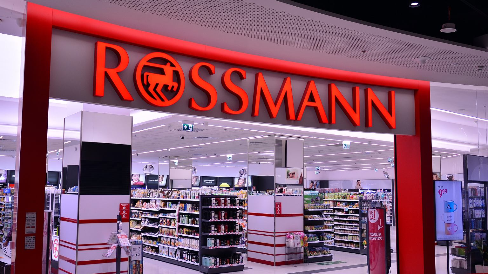
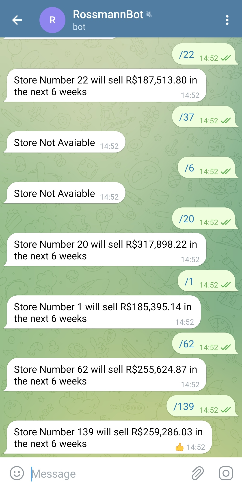
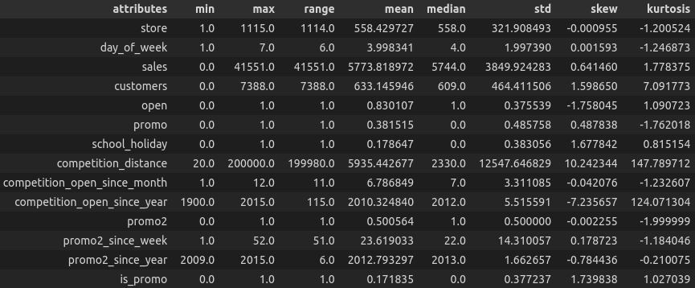
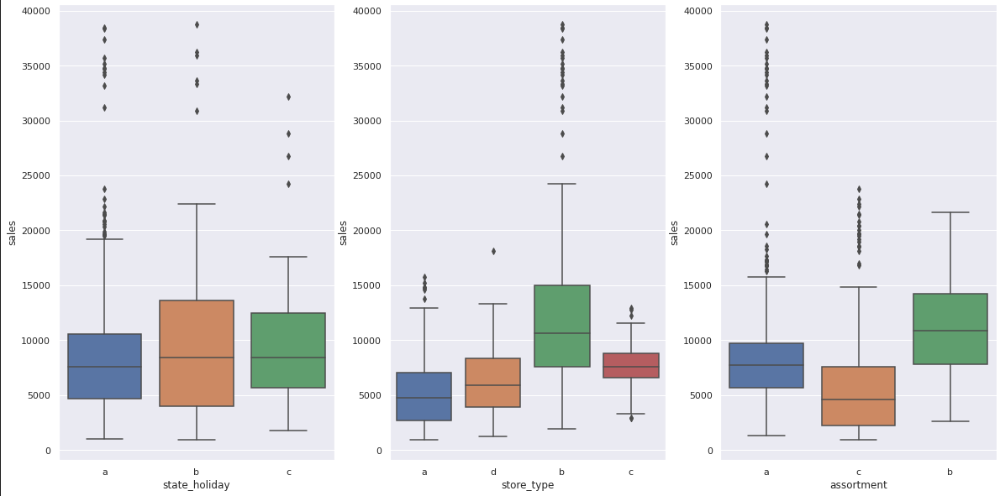
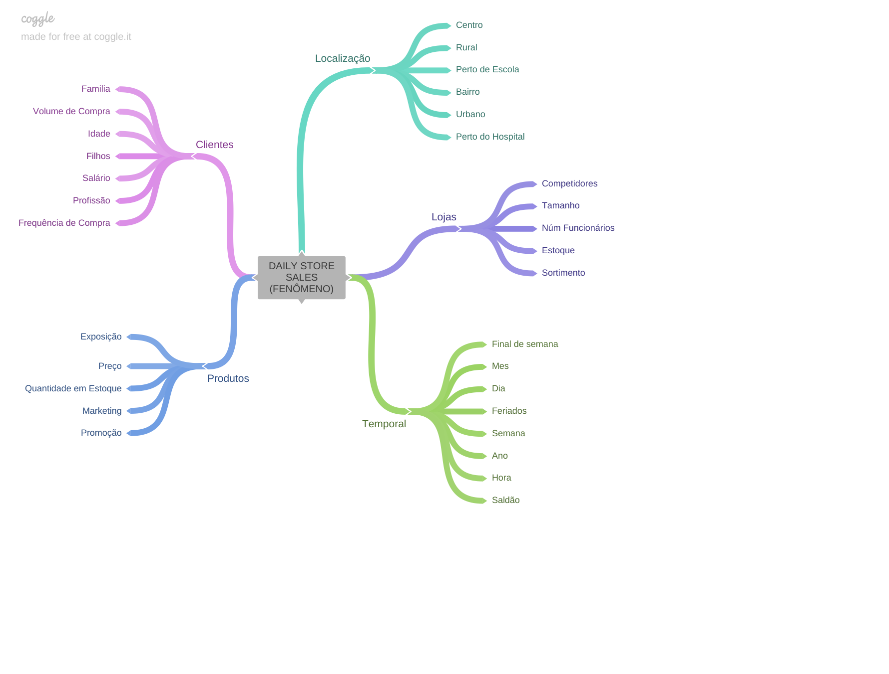
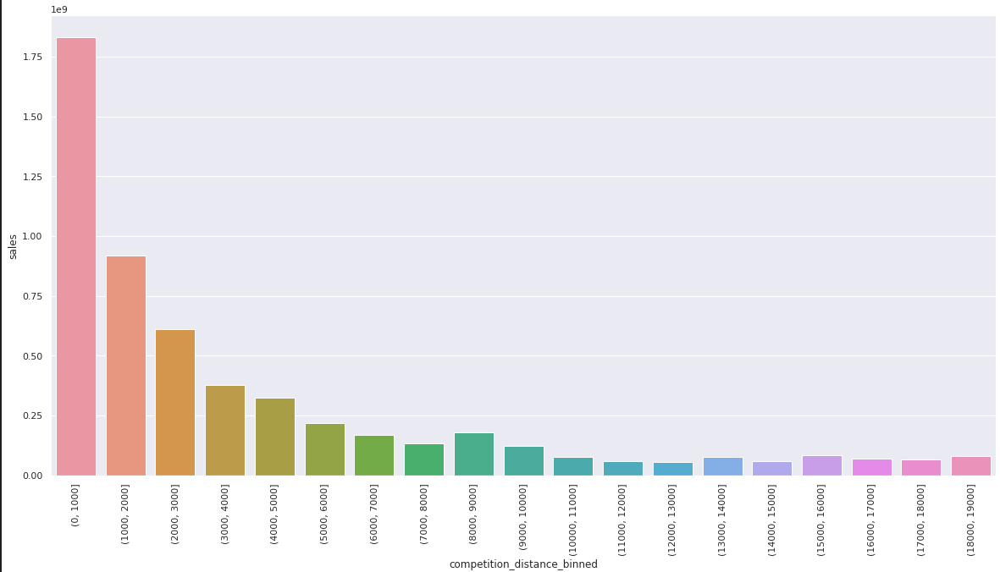
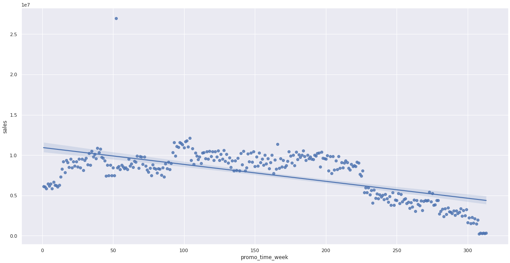
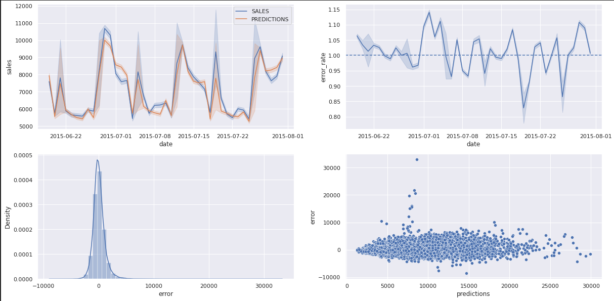
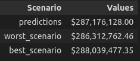

# Rossmann Sales Prediction

### Six-week sales forecast built with a Regression Model

## 1. Abstract

This Data Science project was inspired by a challenge published on [kaggle](https://www.kaggle.com/c/rossmann-store-sales) and presents the construction of a Machine Learning algorithm to predict the 6-week sales of the Rossmann group, which is one of the largest drug store chains in Europe with around 56,200 employees and more than 4000 stores.

To develop this sales projection, was used a dataset with information from 1115 stores, between 2013-01-01 and 2015-07-31. The trained Regression Algorithm reached 88% of MAPE and the estimated result of the total sales for the period was $287.176.128,00. All the solution was developed with Python language and the complete code is available in this [notebook](https://github.com/vitorhmf/sales-predict/blob/main/notebooks/v07_sales_forecast_deploy.ipynb).

The solution was deployed at Heroku Cloud and the sales forecasts can be accessed through a Telegram bot available [here](https://t.me/vitorhmf_rossmann_bot).

**Keywords:** Python, Regression Model, Random Forest, XGBoost, Scikit Learn, Pandas, Seaborn, Boruta, Flask, Heroku

## 2. Methodology

The CRISP-DM methodology was the guide for this data science project development. 

CRISP-DM, which stands for Cross-Industry Standard Process for Data Mining, is an industry-proven way to guide your data mining efforts and it includes descriptions of the typical phases of a project, the tasks involved with each phase, and an explanation of the relationships between these tasks.

**Source:* [IBM Docs](https://www.ibm.com/docs/en/spss-modeler/18.2.0?topic=dm-crisp-help-overview)

To direct your reading, below are links to the development carried out at each stage of the CRISP cycle:

* [Business Understanding](https://github.com/vitorhmf/sales-predict#3-business-understanding)
* [Data Understanding](https://github.com/vitorhmf/sales-predict#4-data-understanding)
* [Data Preparation](https://github.com/vitorhmf/sales-predict#5-data-preparation)
* [Machine Learning Modeling](https://github.com/vitorhmf/sales-predict#6-machine-learning-modeling)
* [Evaluation](https://github.com/vitorhmf/sales-predict#7-evaluation)
* [Depoyment](https://github.com/vitorhmf/sales-predict#8-deployment)

## 3. Business Understanding

### 3.1. Context

During the monthly results meeting, the CFO of the Rossmann group requested the sales projection for the next 6 weeks for each of the stores in the chain. This forecast will be used to define the company's investment in the infrastructure of its stores.

For this project, it was used a dataset containing sales information from 1115 stores, between 2013-01-01 and 2015-07-31. Below are the attributes available for building the model:

| Feature                | Definition                                                                                               |
|------------------------|----------------------------------------------------------------------------------------------------------|
| id                     | unique id that represent store and date of sale                                                          |
| store                  | a unique Id for each store                                                                               |
| sales                  | the turnover for any given day (target variable)                                                         |
| customers              | the number of customers on a given day                                                                   |
| open                   | an indicator for whether the store was open (0/1)                                                        |
| state holiday          | indicates a state holiday (a = public holiday, b = Easter holiday, c = Christmas, 0 = None)              |
| school holiday         | indicates if the (Store, Date) was affected by the closure of public schools                             |
| store type             | differentiates between 4 different store models. (a, b, c, d)                                            |
| assortment             | describes an assortment level (a = basic, b = extra, c = extended)                                       |
| competition distance   | distance in meters to the nearest competitor store                                                       |
| competition open since | gives the approximate year and month of the time the nearest competitor was opened                       |
| promo                  | indicates whether a store is running a promo on that day                                                 |
| promo 2                | Promo2 is a continuing and consecutive promotion for some stores (0/1)                                   |
| promo 2 since          | describes the year and calendar week when the store started participating in Promo2                      |
| promo interval         | describes the consecutive intervals Promo2 is started, naming the months the promotion is started anew.  |

*Source:* [Kaggle](https://www.kaggle.com/competitions/rossmann-store-sales/data)

### 3.2. Business assumption: 
* Null values of competitor distance were replaced to 200.000 meters, assuming that there are no competitors.
* Days when the stores were closed, were not considered
* For the missing values in the "Competition Open Since" variable, the approximate year and month were defined as the value from the column Date. 
* The same was done for the variable "Promo 2 Since".

[Back](https://github.com/vitorhmf/sales-predict#2-methodology)
 
## 4. Data Understanding

### 4.1. Data Wrangling

To build an overview of the data, the following steps were performed:
* Change the columns name to sneak_case;
* Shows the data dimensions (rows and columns);
* Check and Fillout NA: for the missing values in the "Competition Open Since" variable, the approximate year and month were defined as the value from the column Date. The same was done for the variable "Promo 2 Since";
* Change types from float64 to int64;

### 4.2 Data Descriptive: 
A quick descriptive analysis of numerical and categorical variables was performed.
 
**Numerical Attributes:**

**Categorical Attributes:**

 
### 4.3. Feature Engineering

Before performing the feature engineering, a mental map was created to evaluate the relationship between the sales phenomenon and the agents that act on it, as well as the attributes of each agent.

From this mental map, business hypotheses were created in order to develop the understanding of the case and raise new variables that are important to derive from the original dataset for the creation of the machine learning model.
 
In this step, the following features were created:
* Features derived from the Date variable: Year, Month, Day, Week of Year, Year Week. 
* Assortment: a = 'basic'; b = 'extra'; c = 'extended'
* State Holiday: a = 'public holiday; b = 'easter holiday'; c = 'christmas
* Other Features: “Competition Since” and “Promo Since”

### 4.4. Data Filtering

* Filtered the rows for open stores.
* Filtered the rows for sales greater than zero.
* Exclude columns already used to create new features.
* Exclude columns with a single value.

### 4.5. Exploratory Data Analysis

In the data exploration, univariate, bivariate and multivariate analyzes were performed. Of the business insights obtained in this phase, two stood out for presenting different results than expected:

**Stores with closer competitors sell more:**

**Stores with longer promotions sell less:**

[Back](https://github.com/vitorhmf/sales-predict#2-methodology)
 
## 5. Data Preparation

* Standarditazion: not used because none of the variables showed a normal curve;
* Rescaling: in numerical variables, the MinMax Scaler and Robust Scaler methods were used to balance the range of each variable
* Encoding - applied to categorical variables
* Nature Transformation - for cyclic variables such as month, day and week a sine and cosine transformation was applied
* Feature Selection: the variables to be used in the machine learning model were selected using the Boruta algorithm

[Back](https://github.com/vitorhmf/sales-predict#2-methodology)

## 6. Machine Learning Modeling

### 6.1. Comparative Model Performance (with Cross Validation)

The model chosen for the solution was XGBoost. Despite not having achieved the best result, it ended up being the best option when analyzing the cost/benefit of the solution.

### 6.2. Hyperparameter Fine Tunning

After performing the Fine Tunning process, the model reached a MAPE of 88%.

The parameters used to achieve these results were:

 * n_estimators: 3000
 * eta: 0.03
 * max_depth: 5
 * subsample: 0.7
 * colsample_bytree: 0.7
 * min_child_weight: 3

[Back](https://github.com/vitorhmf/sales-predict#2-methodology)

## 7. Evaluation

[Back](https://github.com/vitorhmf/sales-predict#2-methodology)

## 8. Deployment

[API Code](https://github.com/vitorhmf/sales-predict/tree/main/api)

[BOT Code](https://github.com/vitorhmf/sales-predict/tree/main/rossmann-telegram-api)

[Back](https://github.com/vitorhmf/sales-predict#2-methodology)

## 9. Conclusion

### 9.1. Business Results

The total revenue forecast for the next 6 weeks is presented below, considering the worst and best scenario according to the model. And the detailed sales forecast by store can be consulted through a Telegram bot, available at this [link](https://t.me/vitorhmf_rossmann_bot).

### 9.2. Next Steps

[Back](https://github.com/vitorhmf/sales-predict#2-methodology)

## 10. References

[Back](https://github.com/vitorhmf/sales-predict#2-methodology)
